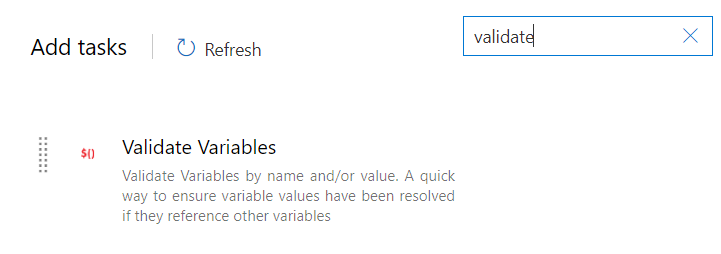
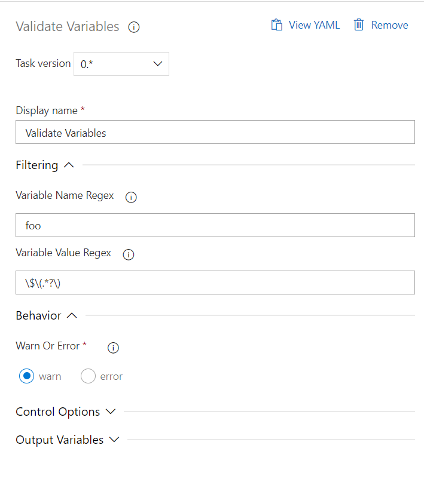

# Validate Azure Devops Variables

This extension checks the value of your variables and either warns or throws an error if they are invalid. By default, "invalid" means that they have not been fully-resolved.  This may happen if you reference a variable which does not exist such as `Variable1: $(Variable2)` where `Variable2` does not exist.  You can filter by name if you're only interested in specific variables.  Additionally, you can supply a regular expression if you would like to invalidate variables based upon a different value.


### Add task
You will find the new Tasks available under the Build or Deploy tab, or search for "variables validate":


Once you have added the task, you either accept the default options, or provide your own values for variable name and variable value in the form of regular expressions:


### If you are writing YAML pipelines:
```
- task: validateVariablesTask@0
  displayName: 'Validate Variables'
  inputs:
    varNameRegex: foo
    varValueRegex: '\$\(.*?\)'
    warnOrError: Warn
```    

### Parameters
- `varNameRegex` - Provide a regular expression by which to filter the variables to check. Default is `.*` (all variables).
- `varValueRegex` - Provide your own regular expression to define an invalid variable value. Default is `\$\(.*?\)`, which matches variables whose values contain `$(anyvalue)`
- `warnOrError:` - either `warn` or `error`. Controls whether the task throws a warning or an error if any matching variables are found. Default value is `error`.
